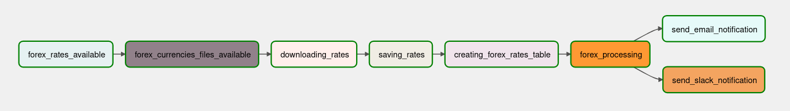
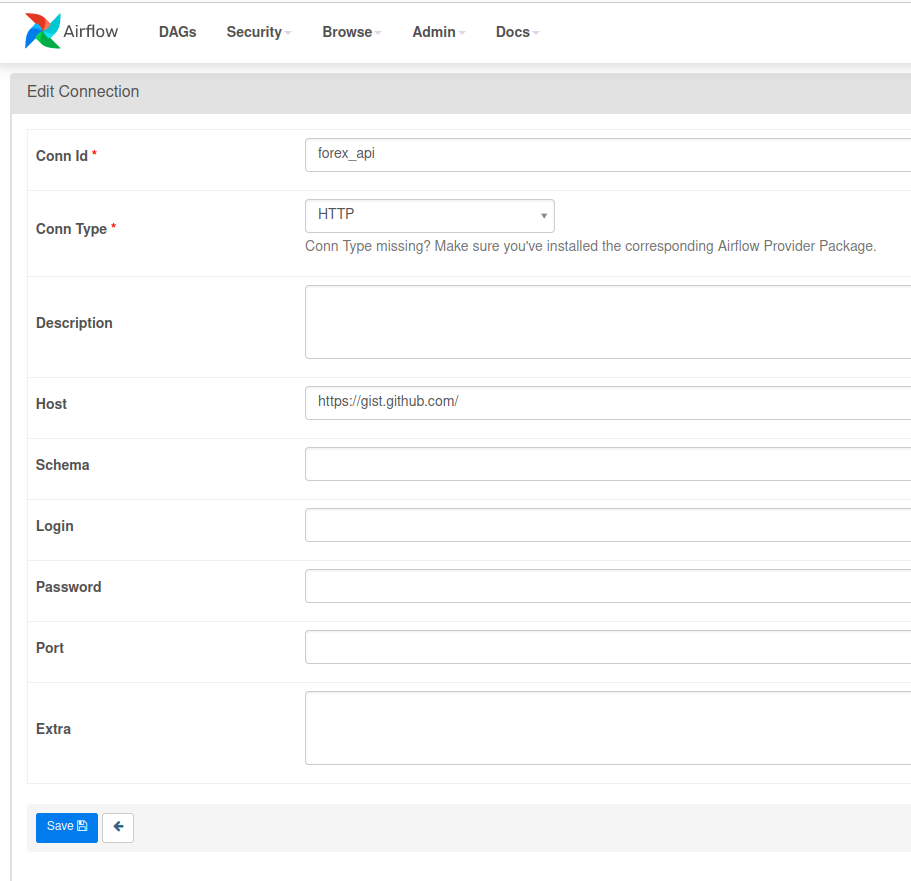
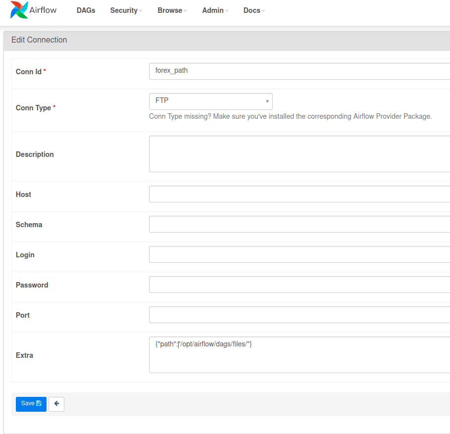
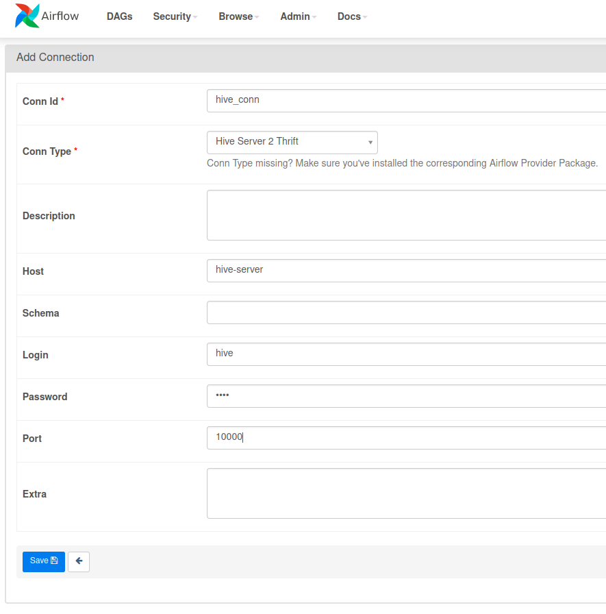
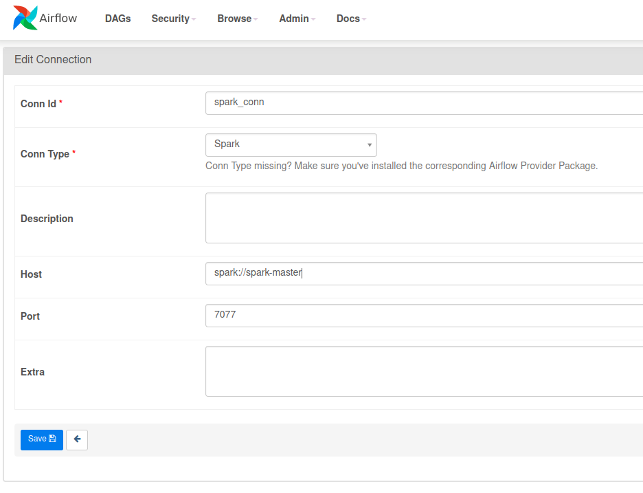
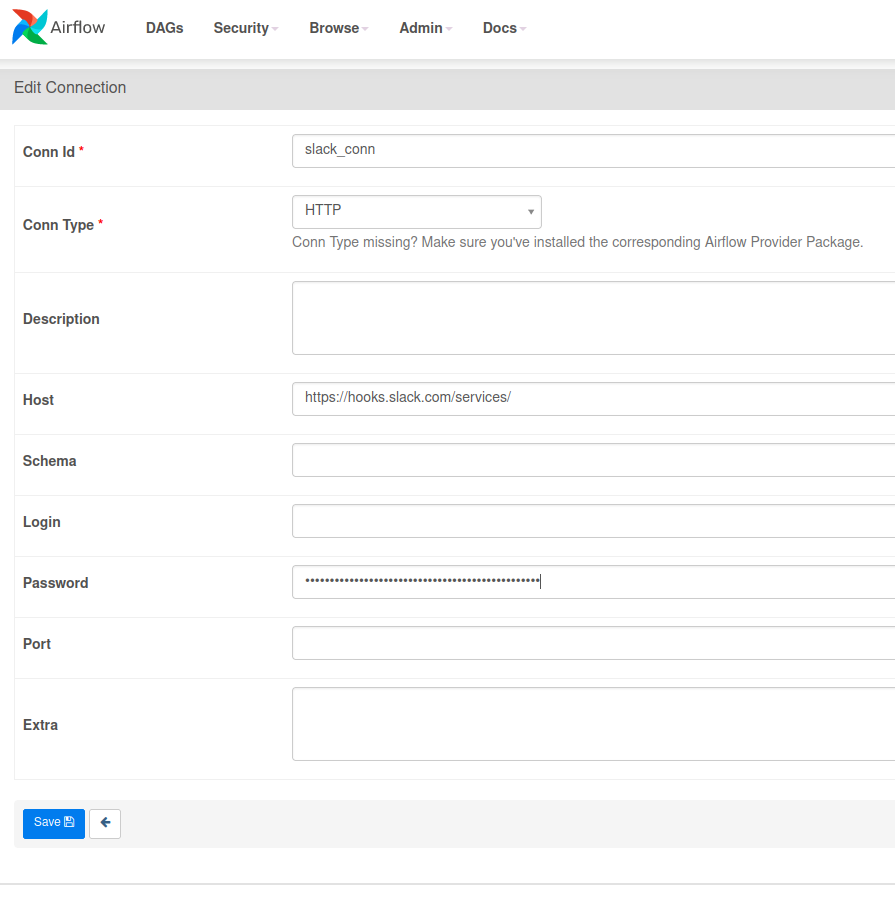

# The Forex Data Pipeline

This is a data pipeline built using airflow as an practical exercise to deepen my hands-on experience with Airflow along with other data tools.

This data pipeline is build while attending the [Apache Airflow: The Hands-On Guide](https://www.udemy.com/course/the-ultimate-hands-on-course-to-master-apache-airflow/?couponCode=GENAISALE24) online course on Udemy by [Marc Lamberti](https://www.udemy.com/course/the-ultimate-hands-on-course-to-master-apache-airflow/#instructor-1)

# Running airflow
This package contains docker images for all needed packages.

Using the 4 bash scripts `start.sh`, `stop.sh`, `restart.sh`, `reset.sh`,
you can control and run needed commands to build, run, stop the docker containers.

## Forex data pipeline

### Setting airflow connections
There are 5 different connections to set for this pipline

- Forex API HTTP connection

- Forex path FTP connection

- Hive connection

- Spark connection

- SlackWebhook connection
